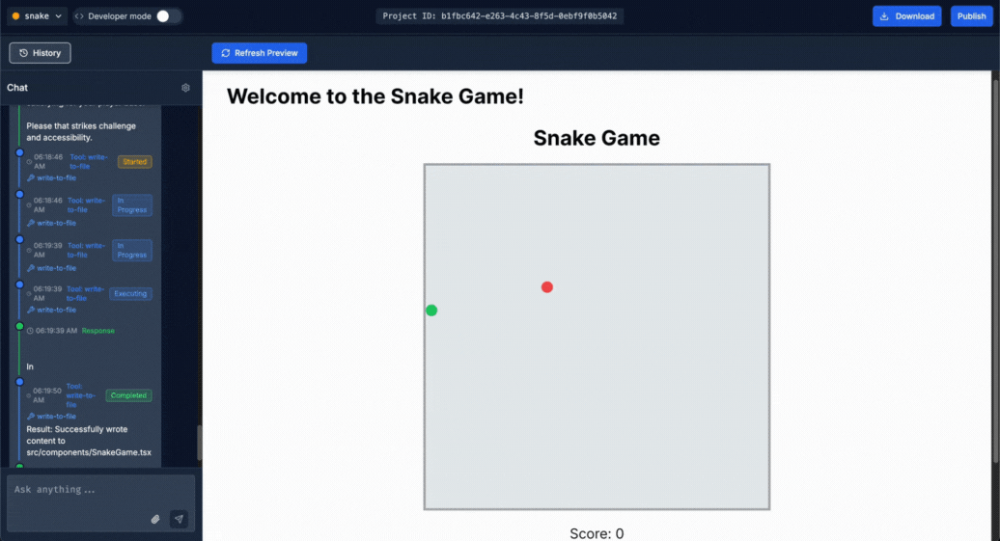

# Building Lovable 
##### Author: Mariano Crosetti

The app has the requirements stated in [the task](https://github.com/lovablelabs/take-home-mariano-crosetti):
- a chat
- a preview window
- a way to work on multiple apps (“projects”)

**What did I care about?** The *focus* was to deliver a minimal but functional text-to-app web app.

In a two-day sprint, I tackled: running the generated app in an isolated container, orchestrating communication with it, and designing the full architecture connecting all components.

The **ultimate goal** is to show that, while my strength lies in algorithms, I can just as well adopt a bold, scrappy approach to design and build systems across multiple stacks, with one clear focus: shipping a product.

## Quick Start




### Setup

1. Clone the repository
   ```
   git clone https://github.com/lovablelabs/take-home-mariano-crosetti.git
   cd take-home-mariano-crosetti/deliverable/
   ```

2. Run the setup script to configure your environment variables:
   ```
   ./setup-env.sh
   ```
   
   This script will prompt you for your Anthropic API key and create a `.env` file.

   Alternatively, you can manually create a `.env` file in the root directory with your API keys:
   ```
   ANTHROPIC_API_KEY=your_anthropic_api_key_here
   ```

### Running the Application

1. Start all services using:

```
./setart.sh
```

2. Open your browser and go to http://localhost:3000

3. Create a new project (upper-right corner).

4. Enter a prompt like "Make a tic tac toe app".

5. Preview your app in the embedded window. 

## Architecture

The system is composed of four main services:

- **Frontend**: Our React/Vite app (built with Lovable) for generating other React/Vite apps through a chat interface. Apart from the chat-to-app functionality, it also supports managing multiple projects, reading code files, and tracking the history of changes.
- **Backend**: Controls the flow of projects (creation, deletion, and history) and contains the logic of the coding agent.
- **Devhost**: The user-generated app runs in a separate container, isolating it from the rest of the codebase. This container includes a minimal service for restarting the development server and installing the necessary dependencies.

## Further Work: LLM Routing Strategy
To enhance scalability and efficiency, I plan to integrate a centralized LLM routing system using [LiteLLM Proxy](https://docs.litellm.ai/docs/simple_proxy). This will allow all services to route LLM queries through a single gateway, enabling caching, usage tracking, provider fallback, and dynamic routing strategies.

In particular:

Provider fallback: automatic switching when a provider reaches its limit or is unavailable.

Custom routing strategies: balancing speed and accuracy by mixing fast, lightweight models with slower, high-accuracy models.

Intelligent model selection: Future work includes exploring ML-based routing (e.g., [matrix factorization on embeddings](https://github.com/lm-sys/RouteLLM/tree/main)) to predict which model to use per query, optimizing cost and performance.

This architecture would make the system more robust, cost-efficient, and adaptable to real-world usage at scale. Although I prioritized building the core text-to-app functionality during the 2-day challenge, implementing this routing layer is a natural next step.
